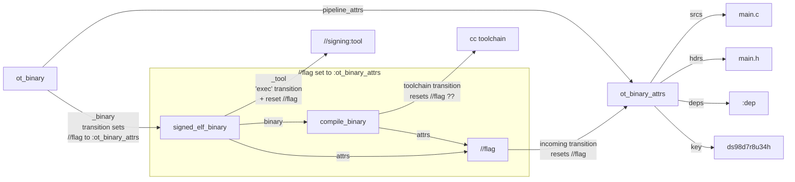

```mermaid
---
config:
  flowchart:
    htmlLabels: true
---
flowchart LR
    ot_binary[ot_binary]
    ot_binary_attrs[ot_binary_attrs]
    main_c[main.c]
    main_h[main.h]
    deps[:dep]
    key[ds98d7r8u34h]

    ot_binary -->|pipeline_attrs|ot_binary_attrs
    ot_binary-->|_binary<br>transition sets<br> //flag to :ot_binary_attrs|sign_binary

    ot_binary_attrs -->|srcs| main_c
    ot_binary_attrs -->|hdrs| main_h
    ot_binary_attrs -->|deps| deps
    ot_binary_attrs -->|key| key

    subgraph "//flag set to :ot_binary_attrs"
        sign_binary[signed_elf_binary]
        compile_binary[compile_binary]

        flag["//flag"]
        compile_binary-->|attrs|flag
        sign_binary-->|attrs|flag
        sign_binary-->|binary|compile_binary
    end

    my_tool["//signing:tool"]
    sign_binary-->|_tool<br>'exec' transition<br>+ reset //flag|my_tool

    cc_toolchain[cc toolchain]
    compile_binary-->|toolchain transition<br>resets //flag ??|cc_toolchain

    flag
        -->|incoming transition<br> resets //flag|ot_binary_attrs
```